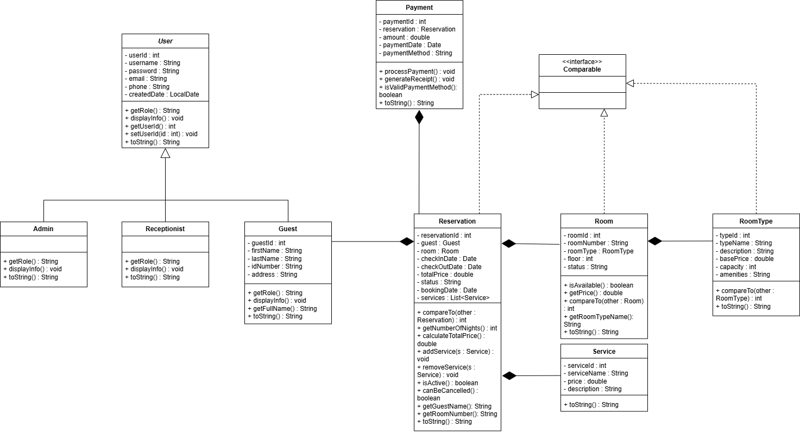
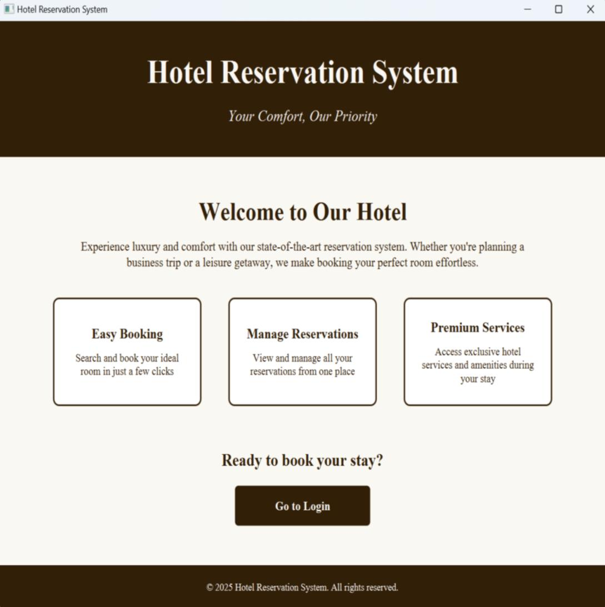
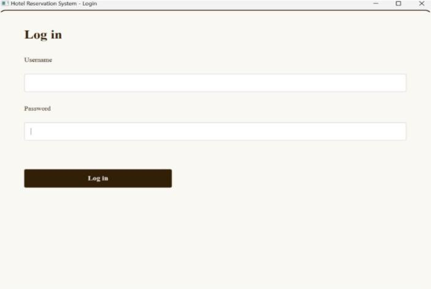
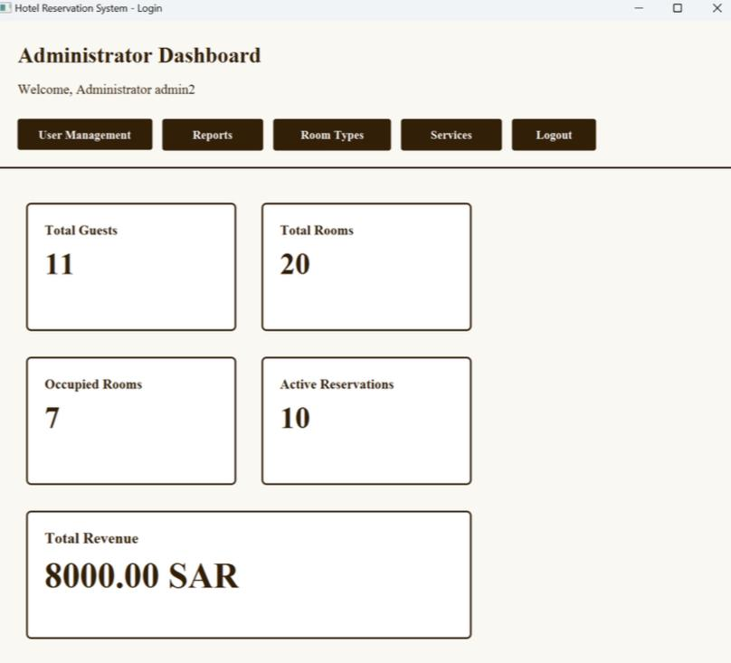
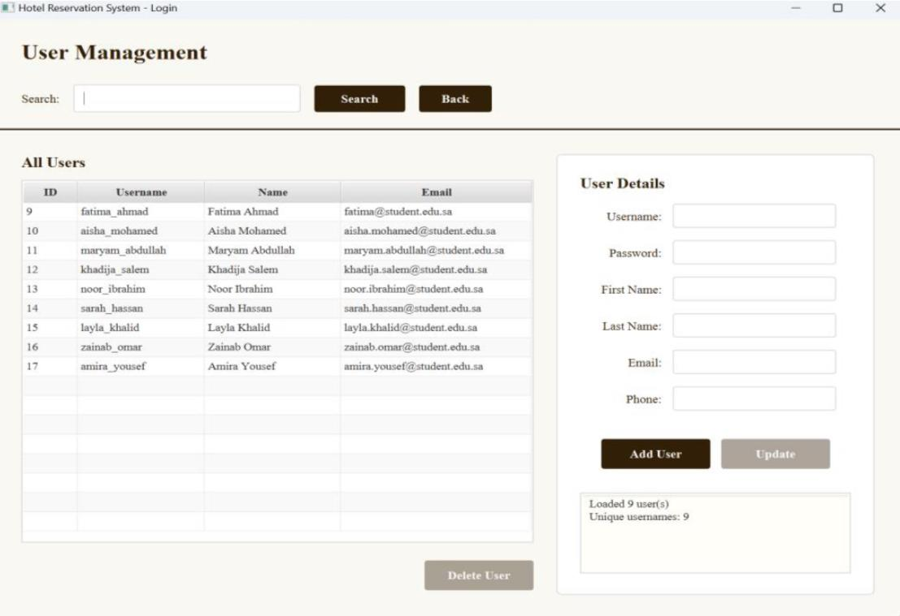
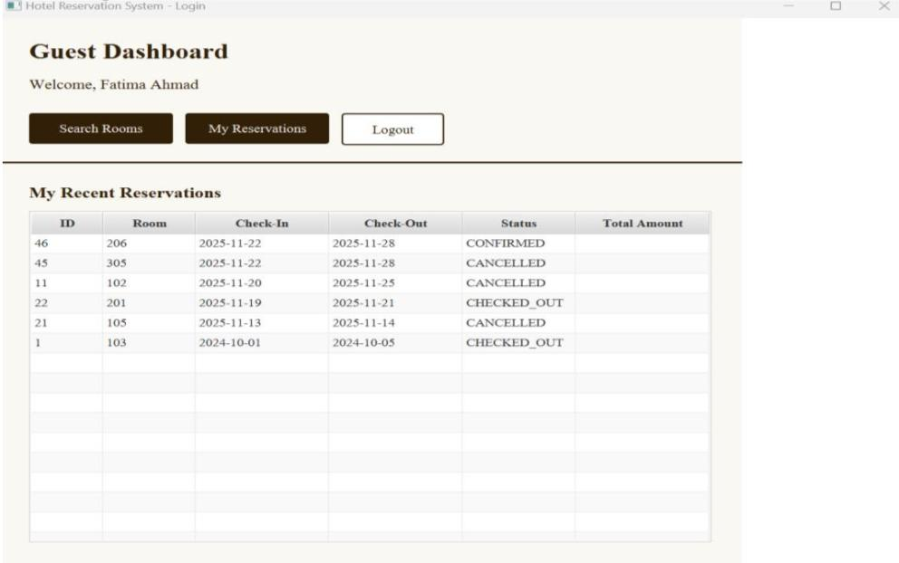
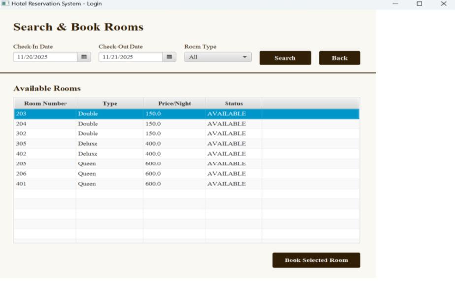
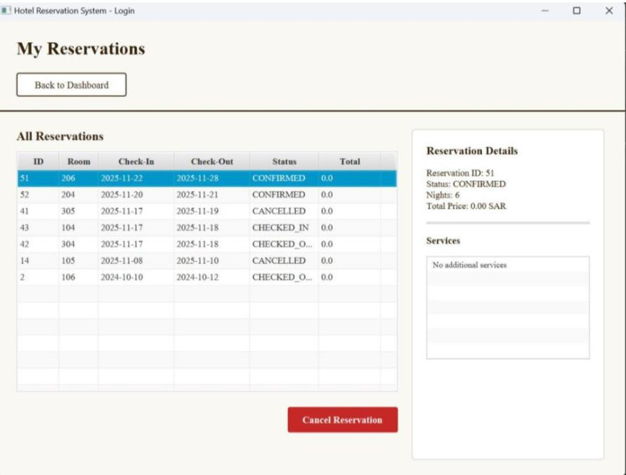
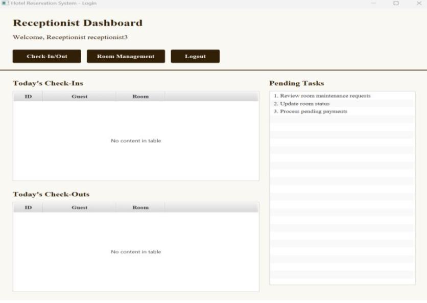
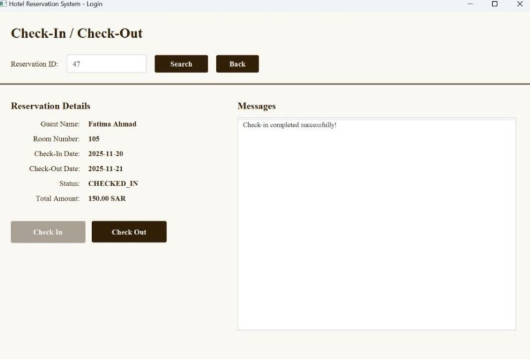

<div align="center">


# 🏨 Hotel Reservation System

### Modern Desktop Application for Hotel Management

<p align="center">


</p>

A role-based desktop application developed using **Java**, **JavaFX**, and **Oracle Database** to simplify hotel operations through an intuitive and efficient reservation management system.

Designed following the **MVC (Model–View–Controller)** architecture, the system provides dedicated interfaces for **Administrators**, **Receptionists**, and **Guests**, ensuring a seamless hotel management experience.

</div>

---

# 📑 Table of Contents

- [📖 Project Overview](#-project-overview)
- [✨ System Highlights](#-system-highlights)
- [🚀 Features](#-features)
- [🛠️ Tech Stack](#️-tech-stack)
- [🏗️ System Architecture](#️-system-architecture)
- [📐 UML Class Diagram](#-uml-class-diagram)
- [📸 Application Preview](#-application-preview)
- [🗄️ Database](#️-database)
- [🚀 Getting Started](#-getting-started)
- [📂 Project Structure](#-project-structure)
- [🤝 Team Project](#-team-project)
- [📄 License](#-license)

---

# 📖 Project Overview

The **Hotel Reservation System** is a desktop application designed to streamline hotel operations through an intuitive graphical user interface.

The system enables hotel staff to efficiently manage rooms, reservations, guests, and hotel services while allowing guests to search for available rooms and manage their reservations.

Built using **JavaFX** and integrated with **Oracle Database**, the application follows the **MVC architecture**, promoting clean code organization, scalability, and maintainability.

---

# ✨ System Highlights

- 🔑 Secure Role-Based Authentication
- 🏨 Hotel Room Management
- 📅 Reservation Management
- 👤 Guest Reservation Portal
- 👨‍💼 Administrator Dashboard
- 👨‍💻 Receptionist Dashboard
- 🛏️ Room Availability Tracking
- 📊 Hotel Statistics & Reports
- 🗄️ Oracle Database Integration
- 🧩 MVC Architecture
- 🎨 Modern JavaFX User Interface

---

# 🚀 Features

## 👨‍💼 Administrator

- Manage system users
- View hotel statistics
- Generate reports
- Manage room types
- Manage hotel services
- Monitor reservations
- Administrative dashboard

---

## 👨‍💻 Receptionist

- Check guests in
- Check guests out
- Manage room availability
- Search reservations
- View daily activities
- Handle front desk operations

---

## 👤 Guest

- Search available rooms
- Book rooms
- View reservation history
- Cancel reservations
- Manage bookings
- Access personal dashboard

---

# 🛠️ Tech Stack

| Technology | Purpose |
|------------|----------|
| ☕ Java | Core application development |
| 🎨 JavaFX | Desktop graphical user interface |
| 📄 FXML | UI layout design |
| 🗄️ Oracle Database 21c XE | Data storage |
| 🔌 JDBC | Database connectivity |
| 🧩 MVC Architecture | Software architecture |
| 🛠️ Apache Ant | Project build tool |
| 💻 NetBeans IDE | Development environment |
| 📐 draw.io | UML Class Diagram |

---
# 🏗️ System Architecture

The application follows the **MVC (Model–View–Controller)** architecture, separating the user interface, business logic, and database operations.

```text
                User
                  │
                  ▼
         JavaFX User Interface
                  │
                  ▼
             Controllers
                  │
        ┌─────────┴─────────┐
        ▼                   ▼
   Business Logic       Validation
                  │
                  ▼
                 JDBC
                  │
                  ▼
         Oracle Database
```

### Architecture Benefits

- Separation of concerns
- Easier maintenance
- Improved scalability
- Better code organization
- Enhanced reusability

---

# 📐 UML Class Diagram

The system was designed following Object-Oriented Programming principles.

The UML Class Diagram illustrates the relationships between the system classes and was created during the design phase using **draw.io**.

<p align="center">

</p>

---

 # 📷 User Interface Preview

## 🏠 Home Page

<p align="center">

</p>

> The landing page introduces the system and provides users with quick access to the login page.

---

## 🔐 Login

<p align="center">

</p>

> Secure authentication for **Administrators**, **Receptionists**, and **Guests**.

---

## 👨‍💼 Administrator Dashboard

<p align="center">

</p>

> Displays hotel statistics including rooms, reservations, guests, and total revenue.

---

## 👥 User Management

<p align="center">

</p>

> Allows administrators to manage user accounts through CRUD operations.

---

## 👤 Guest Dashboard

<p align="center">

</p>

> Guests can quickly access their reservations or search for available rooms.

---

## 🛏️ Search & Book Rooms

<p align="center">

</p>

> Browse available rooms based on selected dates and room type before completing a reservation.

---

## 📅 My Reservations

<p align="center">

</p>

> View reservation history, reservation details, and cancel bookings when applicable.

---

## 👨‍💻 Receptionist Dashboard

<p align="center">

</p>

> Receptionists can manage daily hotel operations, including check-ins and check-outs.

---

## 🔑 Check-In / Check-Out

<p align="center">

</p>

> Complete guest check-in and check-out procedures while updating reservation status automatically.

---

# 🗄️ Database

The application stores all hotel information in **Oracle Database 21c XE**.

### Main Entities

- Users
- Guests
- Receptionists
- Administrators
- Rooms
- Room Types
- Reservations
- Payments
- Hotel Services

### Database Features

- Relational database design
- Primary and foreign key constraints
- Data integrity
- Efficient reservation management
- Optimized queries using JDBC

  # 🚀 Getting Started

Follow these steps to set up and run the project locally.

## Prerequisites

Before running the project, make sure you have:

- Java JDK 17 or later
- NetBeans IDE
- JavaFX SDK
- Oracle Database 21c XE
- Apache Ant

---

## Clone the Repository

```bash
git clone https://github.com/sadeemalm2005/HotelReservationSystem.git
```

---

## Configure the Database

1. Install Oracle Database 21c XE.
2. Create a new database user.
3. Execute the SQL scripts:

```
database_schema.sql
sample_data.sql
```

4. Update the database connection settings inside the project if necessary.
5. Run the application from NetBeans IDE.

---

# 📂 Project Structure

```text
HotelReservationSystem
│
├── docs/
│   ├── UML-Class-Diagram.drawio
│   └── UML-Class-Diagram.png
│
├── screenshots/
│   ├── 01-Home-Page.jpg
│   ├── 02-Login.jpg
│   ├── 03-Admin-Dashboard.jpg
│   ├── 04-User-Management.jpg
│   ├── 05-Guest-Dashboard.jpg
│   ├── 06-Room-Search.jpg
│   ├── 07-My-Reservations.jpg
│   ├── 08-Receptionist-Dashboard.jpg
│   └── 09-CheckIn-CheckOut.jpg
│
├── src/
│
├── database_schema.sql
├── sample_data.sql
│
└── README.md
```

---

# 💡 Object-Oriented Programming Concepts

This project demonstrates several core Object-Oriented Programming concepts:

- Encapsulation
- Inheritance
- Polymorphism
- Abstraction
- Exception Handling

---

# 🎯 Future Improvements

The following features could be added in future versions:

- Online payment gateway integration
- Email confirmation for reservations
- Password recovery
- QR code reservation confirmation
- Room image gallery
- Customer reviews and ratings
- Multi-language support
- Dark Mode
- Analytics dashboard
- Email notifications

---

# 🤝 Team Project

This project was collaboratively developed as part of a university **Software Engineering** course.

The project involved the complete software development lifecycle, including:

- System Analysis
- UML Design
- Database Design
- JavaFX Interface Development
- Database Integration using JDBC
- Testing and Debugging

---

# 📄 License

This project was developed for **educational purposes only** as part of a university course.

---

<div align="center">

## ⭐ Thank You for Visiting!

If you found this project interesting, consider giving it a ⭐ on GitHub.


</div>
